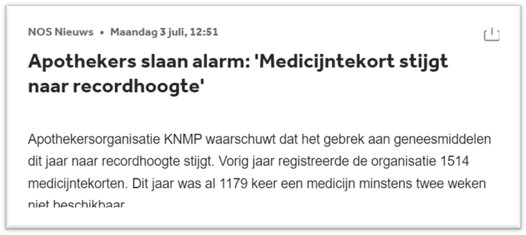
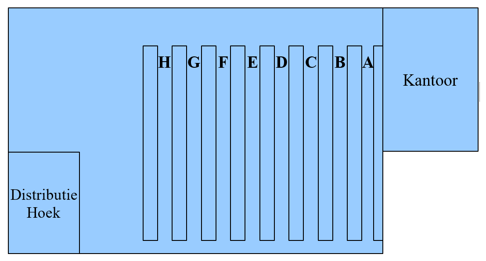

# Huidige situatie

Timaflu is een groothandel die medicijnen verkoopt. Timaflu levert alleen aan apothekers die op hun beurt zorgen voor de verdere verspreiding van de medicijnen. Timaflu is nu een bedrijf met vijftien medewerkers en een directie, en is daarmee een relatief kleine speler in de wereld van de medicijngroothandelaren.

Recentelijk is in het nieuws gekomen dat er in Nederland medicijntekorten aan het ontstaan zijn. Ook de directie van Timaflu maakt zich hierover zorgen.

De directie van het bedrijf denkt dat er ruimte is voor groei van het bedrijf, maar wil ook een meer betrouwbare leverancier worden voor medicijnen. Mensen moeten erop kunnen vertrouwen dat Timaflu levert wat ze belooft, en dat dat op tijd en nauwkeurig gebeurt. Er moet dus voldoende voorraad zijn.
Er moet ook niet te veel voorraad zijn. Medicijnen hebben een beperkte houdbaarheid. Als deze wordt overschreden, dan is het opruimen van overtollige voorraad een kostbare zaak. Dit moet allemaal via dure processen gebeuren volgens strenge regels. Daarnaast is overproductie van verkeerde medicatie ook ongewenst met oog op het medicijntekort. (Grondstoffen worden dan voor de verkeerde medicatie gebruikt. Die hadden beter besteed kunnen worden aan medicijnen die wel nodig zijn.)

## Vestiging

Het bedrijfspand waar Timaflu nu in gevestigd is, is gelukkig op de groei gekocht (Figuur 1). Kantoorruimte is er te over, de helft wordt nog niet gebruikt. Het magazijn heeft een klimaatregeling en is dus ideaal voor de opslag van medicijnen. Deze klimaatregeling koelt het magazijn tot 10 graden. Dit is een goede temperatuur voor het bewaren van medicijnen. Het is niet heel prettig voor de magazijnmedewerkers. Er gaat veel koelvermogen verloren omdat medewerkers vaak het magazijn in en uit moeten lopen. Daarnaast krijgen medewerkers vaak een zware verkoudheid of zelfs griep omdat ze vanuit de warmere delen van het gebouw het koude magazijn in moeten lopen, en weer terug. Het ziekteverzuim is daardoor aanzienlijk.

Het magazijn is 25 meter lang, 30 meter breed en 6 meter hoog. Het vloeroppervlak wordt nu voor ongeveer 60% gebruikt en van de hoogte nog geen 30%. De gangen in het magazijn lopen van A t/m H. Elke gang heeft veertig schappen; aan de kantoor- en distributiekant ieder twintig. (Twee lagen van ieder tien schappen aan iedere kant.)
Het kantoor is met een dubbele deur verbonden met het magazijn. De distributiehoek is een afgezonderde hoek binnen het magazijn. Er zit een roldeur naar buiten om bestellingen te kunnen laden. Er is een glazen deur naar het magazijn. De distributiehoek is gescheiden van het magazijn door een glazen wand om zo het magazijn niet te donker te laten zijn. Het glas zorgt voor verlies van koelvermogen van het magazijn, maar het is veel prettiger voor de magazijnmedewerkers door de lichtinval.

*Figuur 1: Inrichting van Timaflu’s bedrijfspand.*

## Personeel

Hoewel er geen sprake is van strikt-gescheiden afdelingen binnen Timaflu is er toch een soort verdeling van de medewerkers. Die is als volgt:

| Afdeling | Aantal Medewerkers |
| --- | :---: |
| Verkoop | 5 |
| Magazijn (Orders Verzamelen) | 3 |
| Inkoop | 2 |
| Administratie | 2 |
| Koeriers | 3 |
| Acquisitie | 1 |

## Bestellingen

Timaflu heeft 50 tot 60 klanten die telefonisch hun bestellingen doorgeven. Voor 16.00 uur besteld, betekent dat het de volgende dag voor 12.00 uur ’s-middags geleverd wordt. Een eventuele spoedbestelling wordt nog diezelfde dag geleverd, maximaal 3 uur nadat de order is geplaatst.
Een bestelling wordt genoteerd op een orderformulier dat in excel geschreven is. Op dit orderformulier worden de volgende zaken ingevuld: datum, klantnaam, afleveradres, betaaladres en alle bestelgegevens. Per bestelregel wordt genoteerd wat er besteld wordt: artikelnummer, naam van het artikel, het bestelde aantal en de prijs.

Nadat de order is opgenomen wordt de totaalprijs van de order berekend. Bij een order van
€ 500,- of meer wordt een korting gegeven van 5% over het totaalbedrag van de order. Over het bedrag wat er dan staat wordt nog eens de klantkorting berekend. Er worden overigens nogal wat fouten gemaakt met deze berekeningen. Om de klantkorting te berekenen moet een verkoopmedewerker de jaaromzet van een klant opzoeken. Een klantkorting is namelijk gekoppeld aan de jaaromzet die een bepaalde klant heeft en wordt éénmaal per jaar, op 31 december, bepaald voor het jaar daarop volgens Tabel 1.

| Jaaromzet | Kortingspercentage |
| --- | --- |
| < € 10.000,- | 5,00% |
| >= € 10.000,- en < € 20.000,- | 10,00% |
| >= € 20.000,- | 15,00% |

*Tabel 1: Klantkorting volgens jaaromzet.*

Wanneer het totaalbedrag berekend is, wordt nog een laatste goedkeuring gevraagd aan de klant. Als de klant akkoord gaat met de totaalprijs, wordt het orderformulier opgeslagen. Daarna wordt het orderformulier afgedrukt op papier, en in een bak gelegd met orderformulieren.
Wanneer de klant niet akkoord gaat, zijn er twee opties. De klant wil zijn huidige bestelling aanpassen, of de klant ziet volledig af van de bestelling. In het eerste geval gaat de verkoopmedewerker samen met de klant nog door ieder medicijn op de bestelling heen om eventuele aanpassingen te maken. In het twee geval wordt het gesprek afgesloten.

Een paar keer per dag worden alle orderformulieren door een magazijnmedewerker opgehaald en meegenomen naar het magazijn. De magazijnmedewerkers verwerken vervolgens de orders. Ze pakken de bovenste order en verzamelen alle medicijnen totdat de order compleet is. Voor het verzamelen gebruiken ze een soort winkelwagentje waarmee ze (soms letterlijk) door het magazijn crossen. Als een order compleet is, wordt deze verpakt in grote dozen (formaat verhuisdoos). Dan worden de dozen naar de distributiehoek gebracht. De distributiemedewerker plakt op deze dozen een sticker waarop het afleveradres en de klantnaam wordt geschreven. De verwerkte invulformulieren worden aan het einde van de dag opgehaald door een administratie-medewerker. De administratie maakt dan de volgende dag aan de hand van het invulformulier een factuur.
De dozen worden in een hoek van het magazijn verzameld en door de distributie-medewerker verdeeld tussen de koeriers die bij het bedrijf werken om af te leveren bij de klanten. Hij maakt hiervoor voor iedere koerier een koeriersoverzicht met de naam en adresgegevens van de locaties waar ze medicijnen moeten afleveren. Mocht het om een spoedje gaan, dan komt hiervoor een aantekening op het koeriersoverzicht.
Mocht er een spoedkoerier ingeschakeld zijn voor een bestelling, dan wordt deze apart gehouden tot de spoedkoerier hem kan ophalen. (Zie ook verder in dit hoofdstuk met betrekking tot spoedleveringen.)

Als blijkt dat een product niet meer in het magazijn aanwezig is, wordt het product gemarkeerd op het invulformulier. De order wordt wel verder afgewerkt en geleverd. De ontbrekende producten worden ook op een intern bestelformulier geschreven. Het interne bestelformulier wordt aan het eind van de dag naar de afdeling Inkoop gebracht.
Omdat de klant niet weet dat er producten niet op voorraad zijn gaat in het geval van ontbrekende producten het invulformulier direct terug naar de afdeling verkoop. Zij nemen contact op met de klant en maken een afspraak over de producten die nu niet geleverd kunnen worden. De contactpersoon van de klant wordt gebeld en deze heeft de keuze om een product wel of niet af te nemen. Bij elk product wordt individueel de keuze aangegeven. Indien de order geen producten meer bevat die geleverd hoeven te worden, dan gaat het invulformulier naar de administratie. Moeten er nog wel producten geleverd worden, dan gaat het formulier terug naar het magazijn.

Het kan ook zijn dat een klant een spoedbestelling plaatst. In dat geval zal de verkoopmedewerker onmiddellijk nadat de order geplaatst is, kijken of één van de eigen koeriers beschikbaar is om de bestelling te bezorgen. Als dit niet zo is, dan wordt een spoedkoerier gebeld. (Deze spoedkoeriers zijn niet in dienst van het bedrijf.) Hierna loopt de verkoopmedewerker direct met een afgedrukt orderformulier naar het magazijn. Het orderformulier komt bovenop de stapel orders te liggen en zal zo snel mogelijk worden afgehandeld. Hierbij krijgt de bestelling een extra sticker met daarop “Spoed” op de dozen geplakt. Een spoedbestelling wordt altijd als eerste afgeleverd als hij door een eigen koerier wordt geleverd. Als er een spoedkoerier besteld is, dan levert deze de bestelling zonder andere medicijnen te verdelen.

Dat de verkoopafdeling niet 100% precies weet wat er in het magazijn voorradig is, is erg onwenselijk. Het is wel eens voorgekomen dat een belangrijk medicijn voor een spoedoperatie wel verkocht was als spoedbestelling, maar dat dit uiteindelijk niet geleverd kon worden. Dit is een situatie die de directie koste wat kost in de toekomst wil voorkomen. Een fout als deze kan mensenlevens kosten.

De klanten van Timaflu krijgen elk kwartaal een nieuwe productcatalogus waarin van elk product de productgegevens staan beschreven zoals:

- naam van het medicijn
- hoeveelheden werkzame stoffen
- bestelcode
- prijs per grootverpakking
- verpakkingssoort: doos, strip, glazen/plastic fles, verstuiver, injectienaald, enz.
- aantal detailhandelsverpakkingen dat in een grootverpakking zit
- korte en lange omschrijvingen van het medicijn
- minimale bestelhoeveelheid

## Voorraad

Het op orde houden van de voorraad is nattevingerwerk. De magazijnmedewerkers doen dit op gevoel en hoewel het niet vaak voorkomt gebeurt het toch wel eens dat een product op is. De magazijnmedewerkers melden aan de inkoopmedewerkers of een product besteld moet worden.
De inkoopmedewerkers hebben een lijst waarin producten gekoppeld zijn aan fabrikanten. De volgende gegevens van een fabrikant zijn bekend: naam, adresgegevens, contactpersoon, telefoonnummer en het internetadres waar besteld kan worden.

De inkoopafdeling bekijkt iedere ochtend of er nieuwe interne bestelformulieren zijn. Per product kijkt de inkoper welke fabrikant het goedkoopst levert. De inkoopmedewerker neemt dan contact op met de fabrikant om de bestelling de plaatsen. Als de goedkoopste fabrikant niet kan leveren, dan zoekt de inkoopmedewerker de volgende, meest goedkope oplossing.
Soms komt het voor dat een medicijn niet meer in productie is bij de leverancier. De lijst met fabrikanten voor een product wordt dan ge-update en een andere fabrikant mag het geneesmiddel leveren.
Als geen enkele fabrikant het product meer kan leveren, dan wordt het product verwijderd van de interne bestellijst.

Ook krijgen de inkoopmedewerkers regelmatig berichten van (nieuwe) leveranciers die nieuwe medicijnen aanprijzen. Deze berichten worden iedere dag bekeken nadat het intern bestelformulier afgehandeld is. Ieder aanbod wordt bekeken en beoordeeld. De inkoopafdeling bundelt al hun bevindingen en geeft dan een advies aan de directie. De directie besluit of een medicijn opgenomen zal worden in het assortiment of niet. Als Timaflu een nieuw medicijn wil gaan verkopen, dan wordt het medicijn toegevoegd aan het intern bestelformulier en het bestelformulier dat door verkoop wordt gebruikt, alsook aan de eigen overzichten. (En een eventuele nieuwe leverancier ook.)
De lijst van fabrikanten wordt op orde gehouden door de inkoper. Hij verstrekt één keer per week een nieuwe lijst aan de magazijnmedewerkers.

De meeste artikelen zijn per tube of doosje te bestellen. Sommige artikelen worden alleen in grootverpakking verkocht. In dat geval is het wel bekend hoeveel tubes of doosjes er in een grootverpakking zitten.
In het magazijn weten de medewerkers van elk product op welk locatie het staat, bijvoorbeeld C17. De voorraad kan ook zo groot zijn dat er twee of meerdere locaties gebruikt worden om hetzelfde medicijn op te slaan. Het kan nooit zo zijn dat er meerdere medicijnen op één locatie staan.

> *Voor deze casus wordt het proces van het ontvangen van nieuwe voorraad buiten beschouwing gelaten. Het hele proces van ontvangen van leveringen van producenten, en deze in het magazijn leggen, de voorraad aanpassen en alles dat daarbij komt kijken, ligt buiten de context van de casus.*

## Distributie

Het bedrijf heeft een drietal koeriers in dienst om medicijnen uit te leveren. Ieder van de koeriers levert in een bepaalde regio van het afzetgebied van het bedrijf. Aan het begin van de dag komen de koeriers binnen en melden ze zich aanwezig. Dan starten de koeriers met het afleveren van de medicijnen die mogelijk al gisteren zijn ingepakt. Er zijn een drietal regio’s. Iedere koerier rijdt alleen in zijn eigen regio. Een koerier neemt alle bestellingen die voor zijn regio klaarstaan in één keer mee.
Als er geen bestellingen klaar staan, blijven de koeriers wachten op bestellingen.
Het kan zijn dat op een leveringsadres niemand aanwezig is om een bestelling in ontvangst te nemen. De koerier laat een bericht achter dat hij geweest is. Helaas kan de koerier de klant niet zelf bellen omdat telefoonnummers niet op de adressticker staan.
De bestelling zal later diezelfde dag nog een keer aangeboden worden. (De koerier komt tussendoor nog een keer bij het magazijn terug om te kijken of er nog andere leveringen klaarliggen.) Al dit op en neer gerij kost best wel wat brandstof voor de auto’s. Met de huidige brandstofkosten is dat een kostenpost die de directie graag zo klein mogelijk houdt. En iedere kilometer die te veel wordt gereden, zorgt ook voor onnodige milieubelasting.
Als er ook dan niemand aanwezig is, dan neemt de koerier de bestelling weer mee naar het magazijn. Hij zet de niet-geleverde bestelling terug in de distributiehoek. De koerier laat de afdeling verkoop weten dat hij een bestelling niet heeft kunnen afleveren. Een verkoopmedewerker zal contact zoeken met de klant om af te spreken wanneer de bestelling wel aangeboden kan worden. Extra kosten die voortkomen uit de afwezigheid van de klant, worden in rekening gebracht aan de klant. Deze extra kosten worden verbonden aan de bestelling, met een korte uitleg van de situatie.
Wanneer een koerier door de dag heen zijn bestellingen heeft afgeleverd. Zodra hij terug is meldt hij zich weer beschikbaar. Dan gaat hij kijken of er nog andere bestellingen voor zijn regio klaarstaan. Hij zal op zijn laatst om 5 uur bestellingen bij het magazijn komen ophalen. Dit is een uur voor de sluitingstijd van het magazijn. De rest is voor de dag erna.
Een uitzondering hierop is een spoedbestelling. Wanneer een koerier beschikbaar is, dan haalt hij ook na 5 uur eventuele spoedbestellingen op bij het magazijn. Bij spoedbestellingen wordt er niet gekeken naar regio’s. De eerste koerier die beschikbaar is levert de spoedbestelling, ongeacht de regio waarin deze afgeleverd moet worden. Als een koerier een spoedbestelling heeft, dan neemt hij verder geen bestellingen mee.
Natuurlijk moet een klant tekenen voor ontvangst bij iedere bestelling die afgeleverd wordt.
Als het 6 uur is geweest, mogen de koeriers naar huis.

## Administratie

Iedere week wordt de administratie bijgewerkt.
Per week wordt een totaalrekening gemaakt voor een klant. Dit gebeurt door alle bestellingen van de klanten te sorteren en bundelen. De kosten van de bestellingen worden dan bij elkaar opgeteld. Er wordt natuurlijk alleen gekeken naar de daadwerkelijk geleverde producten.
Van het totale bedrag wordt een factuur gemaakt. Deze factuur wordt opgestuurd naar de klant. Er wordt ook gecontroleerd of de klant de factuur van de vorige week (of weken) voldaan heeft. Als dit niet zo is, wordt een herinnering gestuurd. Ook de volgende week wordt een (tweede) herinnering verstuurd. Wanneer een factuur niet na drie weken is voldaan, dan neemt een administratiemedewerker contact op met de klant. De administratiemedewerker stelt de klant op zo’n moment een standaard betalingsregeling voor. Als de klant deze niet accepteert, wordt een incassobureau ingeschakeld. Klanten waarvoor een incassobureau is ingeschakeld kunnen geen bestelling meer plaatsen tot het volledige verschuldigde bedrag is voldaan.
Het is niet mogelijk om een factuur in delen te betalen. De bedragen die de klant betaald heeft, worden toegevoegd aan de jaaromzet van die specifieke klant.
Als dit klaar is, worden alle inkoopfacturen betaald. Deze inkoopfacturen zijn alle rekeningen die Timaflu zelf krijgt van de producenten waar Timaflu zijn medicijnen besteld.

## Acquisitie

Het bedrijf heeft ook een accountmanager in dienst. Zij onderhoudt de contacten met de klanten. Daarnaast is het ook haar taak om nieuwe klanten te werven. Hiervoor heeft zij een duidelijke manier van werken.
Ze gaat geregeld naar een apotheek toe die nog geen klant is bij Timaflu. Ze maakt hiervoor eerst telefonisch een afspraak. Wanneer ze op bezoek komt, stelt ze zich netjes voor en geeft haar kaartje af. Daarna vertelt ze iets over het bedrijf Timaflu. Hierbij benadrukt ze dat het bedrijf een familiebedrijf is, dat prijs stelt op persoonlijk contact en zorg.
Daarnaast toont ze de product-catalogus, en legt ze de kortingsvoorwaarden uit. Dit is alle inhoud van het eerste gesprek. De accountmanager overhandigt de potentiële klant een informatiemap met daarin op papier alles dat ze net verteld heeft. De accountmanager neemt hierna netjes afscheid.
Een maand later controleert de accountmanager of de apotheek die ze heeft bezocht al een bestelling gedaan heeft. Als dit zo is, hoeft de accountmanager niets te doen. Als de bezochte apotheek geen bestelling heeft gedaan, dat belt ze nog een keer na. In dit gesprek biedt ze de apotheek een extra incentive. De apotheek zal op de eerste bestelling 10% extra korting krijgen. De voorwaarde is dat de accountmanager in ieder geval een account mag aanmaken voor de nieuwe klant. Hiervoor vraagt ze de nieuwe klant om de naam van het bedrijf, en het factuur- en leveringsadres. De accountmanager geeft deze informatie door aan de afdeling verkoop, met de melding van de eenmalige extra korting.
Als dit gebeurd is, laat de accountmanager het aan de verkoopafdeling om eventuele bestellingen te verwerken.
Mocht de apotheek ook met het incentive nog steeds niet geïnteresseerd zijn, dan houdt het op. De accountmanager neemt geen verdere actie.
